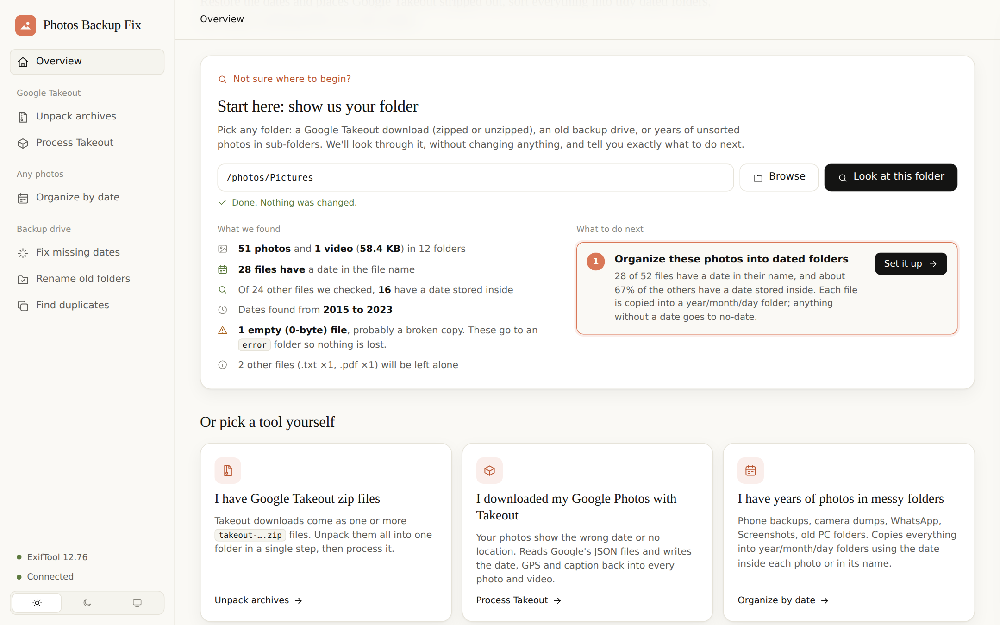
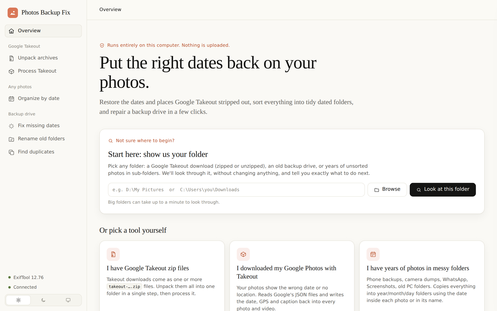
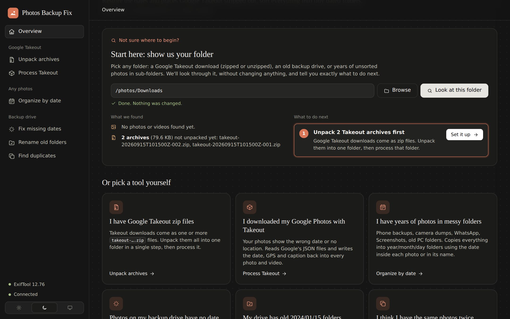
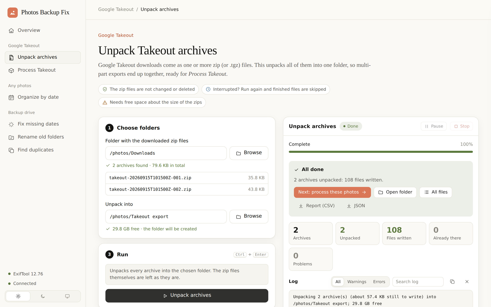
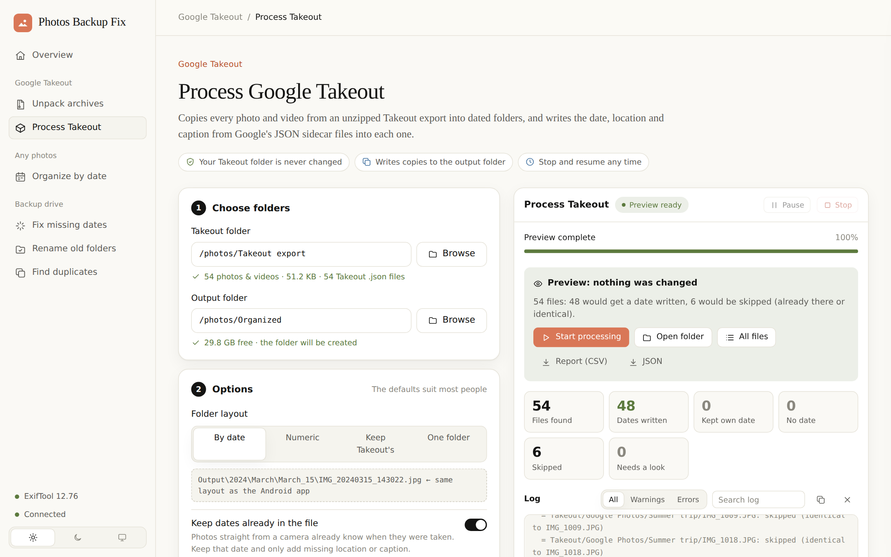
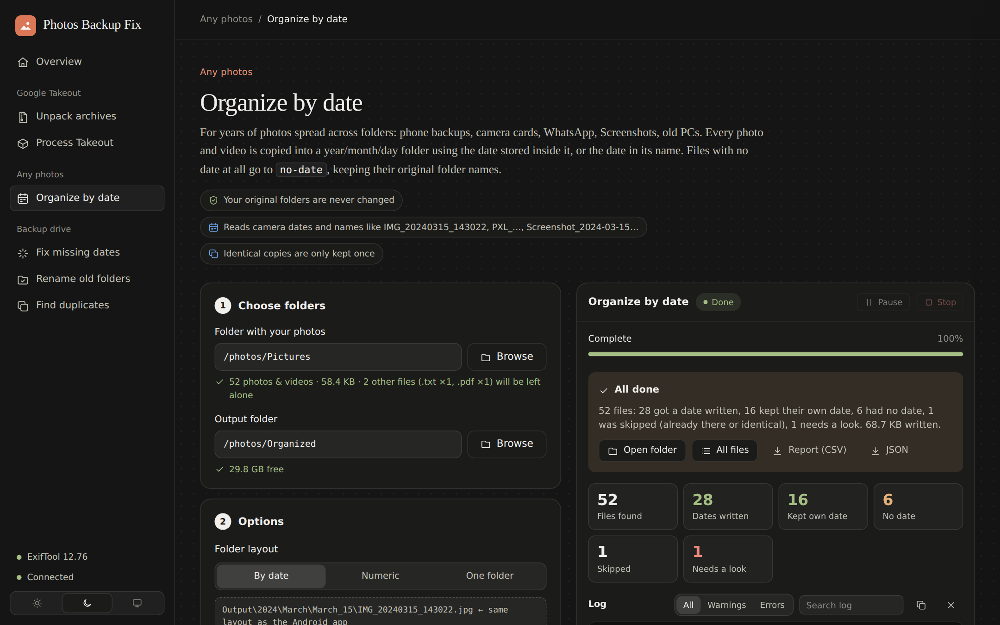
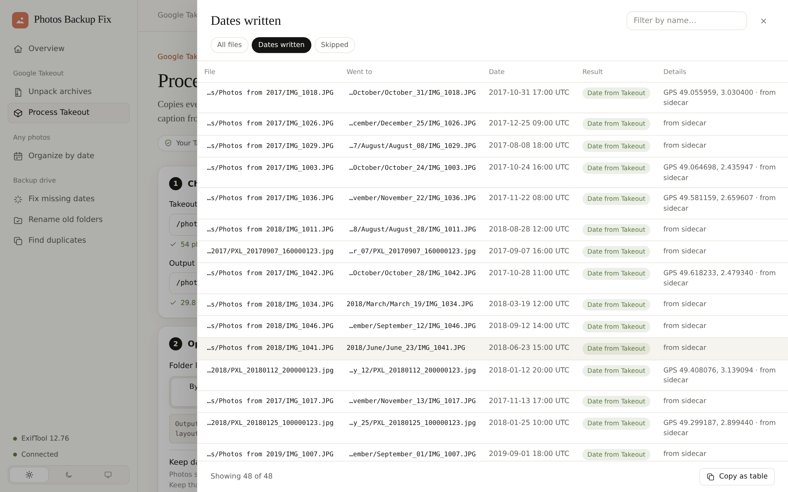
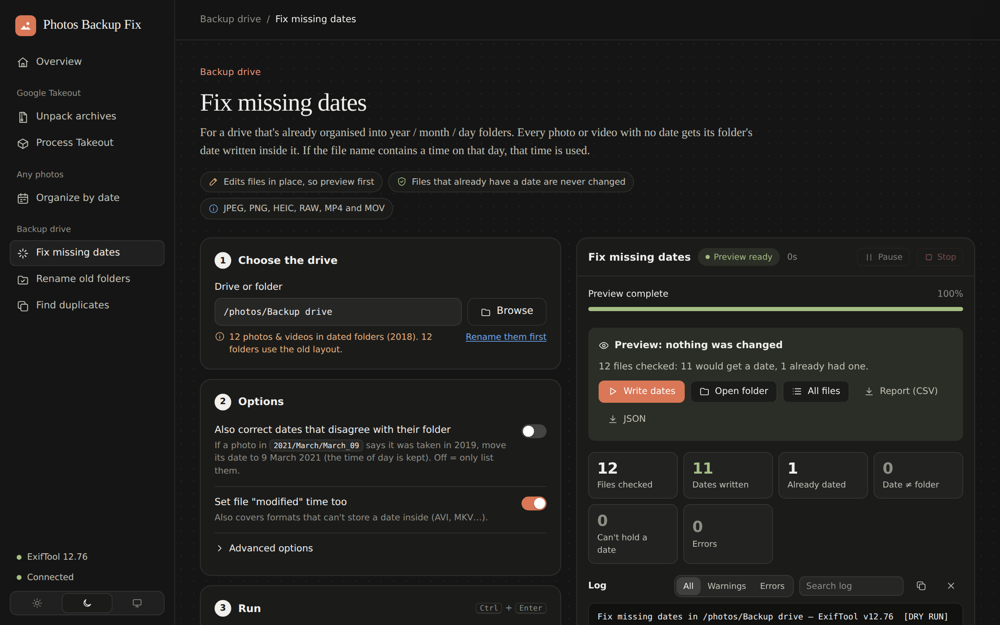

# Photos Backup Fix

Put the right dates back on your photos, and get years of scattered pictures into one tidy, dated folder structure.

- **Windows (desktop):** a local app that opens in your browser. Point it at *any* folder (a Google Takeout download, an old backup drive, or years of unsorted photos) and it tells you what to do, step by step.
- **Android (Übertrag):** backs up your phone's photos to a USB/SD drive in the same layout, and fixes dates on the go.

Both tools use the same folder layout (`2024/March/March_15/`), so they can share one drive.

Both tools speak **English and Japanese (日本語)**. In the browser app, use the **EN / 日本語** switch at the bottom of the sidebar (a Japanese browser starts in Japanese). On Android, open the menu → **Language**, or on Android 13+ use *Settings → Apps → Übertrag → Language*.

<p align="center">
  
</p>

---

## Tool 1 — Windows: Photos Backup Fix (desktop)

### Quick start

1. Download **`PhotosBackupFix-Windows-<version>.zip`** from the [latest release](https://github.com/Firebolt141/Photos-backup-fix/releases/latest) (or the repository zip via **Code → Download ZIP**) and extract it anywhere.
2. Double-click **`Start.bat`**. The first time, it downloads ExifTool, installs Python and Flask if needed, then opens the app in your browser.
3. On the **Overview** page, paste or browse to your photo folder and press **Look at this folder**.
4. Press **Set it up** on the suggested step, choose an output folder, press **Preview**, and when it looks right, **Apply**.

Nothing is uploaded: everything runs on your computer, and the app only listens on `127.0.0.1`.

### What it can do

| Tool | Use it when… | What happens |
|---|---|---|
| 📦 **Unpack archives** | You downloaded Google Takeout as `takeout-….zip` / `.tgz` files | Unpacks every part into one folder (multi-part exports merge). Damaged or incomplete downloads are named so you can re-download just those |
| 🗂 **Process Takeout** | You have an unpacked Takeout export | Copies every photo/video into dated folders and writes the date, GPS, caption, people and favourite from Google's JSON files |
| 🗓 **Organize by date** | Years of photos in messy folders: phone backups, camera cards, WhatsApp, Screenshots, old PCs | Copies everything into `year/month/day` using the date inside each photo or in its name. Undated files go to `no-date/`, keeping their original folder names |
| ✨ **Fix missing dates** | Your backup drive is already in `year/month/day` folders, but some files have no date | Writes each folder's date into files that have none, in place (JPEG, PNG, HEIC, RAW, MP4/MOV). Can also correct dates that disagree with their folder |
| 🏷 **Rename old folders** | Your drive uses the old `2024/01/15` layout | Renames it to `2024/January/January_15`, merging safely |
| 🧬 **Find duplicates** | You suspect the same photos are stored twice | Finds byte-identical files under any name; report only, or move the extras to `_duplicates/`. Never deletes |

<table>
  <tr>
    <td width="50%"><br><sub><b>Overview:</b> pick a folder, or a task</sub></td>
    <td width="50%"><br><sub><b>Start here</b> spots Takeout zips and says to unpack them first (dark theme)</sub></td>
  </tr>
  <tr>
    <td><br><sub><b>Unpack archives:</b> one click to the next step</sub></td>
    <td><br><sub><b>Preview first:</b> nothing is written until you press Apply</sub></td>
  </tr>
  <tr>
    <td><br><sub><b>Organize by date:</b> a messy folder sorted, with a plain-English summary</sub></td>
    <td><br><sub><b>Every file accounted for:</b> searchable results, copyable to Excel</sub></td>
  </tr>
  <tr>
    <td><br><sub><b>Fix missing dates</b> on a drive, with a hint to rename old folders first</sub></td>
    <td valign="top"><sub>Screenshots taken from the real app with a small sample library. On Windows the app uses Segoe UI, so text looks slightly different.</sub></td>
  </tr>
</table>

### Every file ends up somewhere

The tool never silently drops a file:

| What it finds | Where it goes |
|---|---|
| A date (Takeout JSON, inside the file, or in its name) | `2024/March/March_15/` (or `2024/03/15/` with the numeric layout) |
| No date anywhere | `no-date/<original sub-folders>/`, so `no-date/Holiday 2015/IMG_123.jpg` keeps its context |
| Empty (0-byte) or unreadable file, or a copy that failed | `error/<original sub-folders>/` |
| The same photo twice (album copies, "copy of…") | Kept once; the other copy is listed as skipped |
| Two *different* photos with the same name | Both kept: `IMG_1.jpg`, `IMG_1_1.jpg` |
| A JPEG saved with a `.png` name (common with downloads) | Extension corrected to `.jpg` so the date can be written |
| Not a photo (PDF, TXT…) | Left alone, and listed so you know |
| macOS `._` files, `Thumbs.db`, NAS `@eaDir` thumbnails | Ignored: they aren't photos |

If the output drive fills up or is unplugged, the run stops immediately with a clear message instead of failing thousands of files. Press Start again later, and finished files are skipped.

### Output layout

```
Output/
├── 2024/March/March_15/IMG_20240315_143022.jpg   ← same layout as the Android app
├── no-date/Old laptop/Holiday 2015/beach.jpg     ← no date anywhere (original folders kept)
├── error/Scans/broken.jpg                        ← empty / unreadable / failed to copy
└── _photofix/                                    ← reports (report-*.csv/.json) + manifest.json
```

### Options worth knowing

| Option | Tools | What it does |
|---|---|---|
| Folder layout | Takeout, Organize | `2024/March/March_15` (default), `2024/03/15`, keep Takeout's folders, or one folder |
| Keep dates already in the file | Takeout, Organize | Camera dates win; only missing GPS/caption is added |
| Rename files to their date | Takeout, Organize | `IMG_1234.JPG` → `2019-07-04_10-30-00.jpg` |
| Which files | Takeout, Organize | Photos & videos / photos only / videos only |
| Only photos taken between | Takeout, Organize | Process one year (or any date range) at a time |
| Check for duplicates first | Takeout | Review renamed identical copies before processing |
| Also correct dates that disagree with their folder | Fix missing dates | Moves a wrong date to the folder's day, keeping the time of day |
| Move the extra copies | Find duplicates | Moves duplicates to `_duplicates/` instead of only reporting |

### Where the date comes from (in order)

1. A date **already embedded** in the file (kept unless you turn off *Keep dates already in the file*; only missing GPS/caption is added)
2. Takeout `photoTakenTime`
3. The **filename**: `IMG_20240315_143022`, `PXL_…`, `Screenshot_2024-03-15-14-30-22`, `VID-20240315-WA0001`, epoch-millisecond names. Times in filenames are read as this PC's local time; a date with no time becomes 12:00 UTC, the same as the Android app.
4. Takeout `creationTime` (upload date, the last resort)

### What it writes

| Tag | Why it matters |
|---|---|
| `DateTimeOriginal` + `OffsetTimeOriginal` (`+00:00` for sidecar dates) | Primary "taken on" date in Google Photos |
| `CreateDate`, `ModifyDate`, `OffsetTime*` | Secondary dates (Explorer, Lightroom) |
| QuickTime `CreateDate` (UTC) + `Keys:CreationDate` (MP4/MOV) | Video dates in Google/Apple Photos |
| `GPSLatitude/Longitude/Altitude` / `Keys:GPSCoordinates` (video) | Location on the map |
| `ImageDescription`, `XMP:PersonInImage`, `XMP:Rating=5` | Caption, people, favourites |
| File modified time | Sorting in Explorer and apps that ignore EXIF |

### Highlights

- **Fast:** one long-running ExifTool process per worker (`-stay_open`), with parallel workers. That is roughly 10–50× faster than starting ExifTool once per file.
- **Safe re-runs:** stop at any time, then press Start again to continue. Files already in the output are skipped (tracked in `_photofix/manifest.json`) instead of being copied again as `photo_1.jpg`. Files are written under a temporary name and renamed when complete, so an interrupted run never leaves half-written photos behind.
- **Duplicates handled:** the same photo appearing in "Photos from 2019" and in an album is copied once. Different photos with the same name both survive (`IMG_1.jpg`, `IMG_1_1.jpg`). Optional pre-scan for identical files with different names.
- **Better sidecar matching:** truncated `.supplemental-metad.json` names, `(1)` numbering, the 46-character limit, `-edited` in 15 languages, Live Photo videos (`IMG_1.MP4` uses `IMG_1.HEIC.json`), and the JSON `title` field as a last resort.
- **Locked down:** listens on 127.0.0.1 only. Every API call needs a random per-launch token and a localhost `Host` header, so other websites can't drive it.

### Command line

The same engine is available without the browser:

```bat
python cli.py takeout  D:\Takeout E:\Photos --dry-run
python cli.py takeout  D:\Takeout E:\Photos --from 2019-01-01 --to 2019-12-31 --rename-to-date
python cli.py sort     "D:\My Pictures" E:\Photos --only photos   &:: Organize by date
python cli.py fix-dates E:\Photos --fix-mismatched
python cli.py rename   E:\Photos
python cli.py dupes    E:\Photos --move
python cli.py unpack   C:\Users\you\Downloads D:\Takeout
python cli.py analyze  "D:\My Pictures"          &:: what is in here, and what to run
python cli.py takeout --help        &:: all options
```

### Manual setup

Requires Python 3.9+, Flask 3 (`pip install -r requirements.txt`) and ExifTool (on PATH or in `.\tools\`). `core.py` and `cli.py` alone need only the standard library (Python 3.7+).

```bat
python web_app.py [--port 5000] [--no-browser]
```

Tests: `pip install -r requirements-dev.txt` and then `python -m pytest tests/`. The integration tests need ExifTool, and the video test needs ffmpeg.

### Project layout

```
Photos-backup-fix/
├── web_app.py          ← Flask web server (entry point)
├── core.py             ← All processing logic (no GUI deps)
├── cli.py              ← Command-line interface
├── templates/index.html← Browser UI
├── tests/              ← pytest suite (110+ tests, incl. real ExifTool runs)
├── docs/screenshots/   ← README images
├── app.py              ← Legacy tkinter UI (Takeout only)
├── Start.bat           ← Windows launcher
└── setup.ps1           ← PowerShell setup script
```

### How sidecar matching works

| Photo filename | JSON tried |
|---|---|
| `photo.jpg` | `photo.jpg.json` → `photo.json` → `photo.jpg.supplemental-metadata.json` → any truncation like `photo.jpg.suppl.json` |
| `photo(1).jpg` | `photo.jpg(1).json` → `photo(1).json` → `photo.jpg.supplemental-metadata(1).json` |
| `photo-edited.jpg` | the original's sidecar (`-edited`, `-bearbeitet`, `-modifié`, …) |
| Name > 46 chars | truncated at 46 chars (Google's limit) |
| `IMG_1.MP4` (Live Photo) | `IMG_1.HEIC.json` |
| anything else | the sidecar whose `title` field equals the filename |

---

## Tool 2 — Android: **Übertrag**

**Download:** `Ubertrag-<version>.apk` from the [latest release](https://github.com/Firebolt141/Photos-backup-fix/releases/latest). Open it on the phone and allow "install unknown apps" when asked.

**Übertrag** is an Android app (Android 8 or newer) that backs up the phone's photos to a USB drive or SD card, imports Google Takeout, sorts messy folders by date and repairs dates. No computer needed. It uses the same `2024/March/March_15/` layout as the Windows tool, so both can work on the same drive.

The app opens on **Start here**, which asks what you have and sends you to the right tool:

| You have… | Tool | What it does |
|---|---|---|
| Photos on this phone | **Back up phone** | Three steps: choose the drive → scan → copy. Only new photos are copied next time. |
| A Google Takeout export | **Import Google Takeout** | Reads Google's `.json` files and copies every photo/video into Year / Month / Day with the real date, GPS and caption. |
| Years of photos in random folders | **Sort a folder by date** | Walks every sub-folder and copies each file into Year / Month / Day using the date inside it or in its name. |
| A backup drive with undated photos | **Fix dates on the drive** | Writes each day folder's date into photos that have none, and can correct dates that disagree with their folder. |
| A drive from an older version | **Update folder names** | `2024/01/15` and `March 7` → `2024/January/January_15`, `March_07`, merging into existing folders. Shows what will change first. |

### Every file ends up somewhere

Same rule as the Windows tool. No file is skipped silently:

- **Dated** → `Output/2024/March/March_15/`
- **No date anywhere** → `Output/no-date/<original sub-folders>/`
- **Couldn't be processed** (empty or unreadable file) → `Output/error/<original sub-folders>/`
- Files that aren't photos or videos are counted and left where they are. Zip files are reported so you can extract them first.

Originals are never changed or deleted. The import and sort tools copy. *Fix dates on the drive* edits photos in place, and only after the new version has been fully written next to the old one.

### Safe to stop, safe to re-run

- Long jobs run in the foreground with a progress notification and a **Stop** button, so they keep going with the screen off.
- Copies are written under a temporary name and only get their real name once complete, so a pulled cable never leaves a half-copied photo looking finished.
- Run any tool again and finished files are recognised (same name and size) and skipped. A *different* file with the same name gets `_1`, so nothing is overwritten.
- When the drive fills up or is unplugged, the run stops with a clear message instead of failing every remaining file.

### Dates

Where the date comes from, in order:

1. **Import Google Takeout:** the photo's own date (if *Keep dates already in photos* is on), then Google's `photoTakenTime`, then the file name (`IMG_20240315_143022`, `Screenshot_2024-03-15-…`, `PXL_…`, WhatsApp `IMG-20240315-WA0001`, Unix timestamps), then Google's upload date.
2. **Sort a folder by date:** the date inside the file, then the file name.
3. **Back up phone:** the gallery's *date taken*, then the date inside the file, then the file name.

Folders use the time the photo was taken *where it was taken*, so a photo from 23:30 doesn't land in the next day's folder. Dates are written with a UTC offset (`OffsetTimeOriginal`), which Google Photos needs to show the right time.

| Format | Date | GPS / caption | Notes |
|---|---|---|---|
| JPEG / PNG / WebP | ✓ | ✓ | Written by ExifInterface |
| HEIC / HEIF, RAW | ✗ | ✗ | Android can't write these. They are still sorted into the right folder |
| Video | ✗ | ✗ | Sorted into the right folder. Use the Windows tool's *Fix missing dates* to write the date into them |

### Architecture

```
android-app/app/src/main/java/com/firebolt141/photosync/   (package com.firebolt141.ubertrag)
├── data/          Room queue (QueueItem, QueueDao, AppDatabase) + DataStore Prefs
├── repository/    SyncRepository: scan, copy, Takeout, sort, fix dates, rename
├── service/
│   ├── CopyService.kt       ← foreground service for phone → drive copies (Stop action, wake lock)
│   └── KeepAliveService.kt  ← keeps Takeout/sort/fix/rename jobs alive with the screen off
├── ui/            Compose screens: Start, Home, Queue, Takeout, FixExif (sort + fix), Rename
│   └── theme/     Ivory/clay light and slate dark palette, matching the Windows tool
└── util/
    ├── PhotoLogic.kt        ← pure Kotlin: dates from names, folder names, sidecar matching (unit-tested)
    ├── SafTree.kt           ← cached SAF folder access + safe copy (temp name → rename, size check)
    ├── TakeoutProcessor.kt  ← Takeout import and "sort a folder" (shared engine)
    ├── ExifFixer.kt         ← fix dates on the drive
    ├── DateExtractor.kt     ← reads dates inside photos/videos
    └── StorageHelper.kt     ← drive checks, folder rename + merge
```

### Building

Needs JDK 17 or newer (21 recommended). Open `android-app/` in a current Android Studio, or use the Gradle wrapper (it downloads the right Gradle version itself):

```bash
cd android-app
./gradlew assembleDebug          # Windows: gradlew.bat assembleDebug
```

Toolchain: AGP 9.4, Kotlin 2.4, Gradle 9.8, Compose BOM 2026.09; compileSdk 37, targetSdk 36, minSdk 26.

Dev builds are published automatically on every push to `main` as a GitHub release tagged `build-N-<sha>`. CI also runs the unit tests and Android lint.

### Running unit tests

```bash
cd android-app
./gradlew testDebugUnitTest lintDebug
```

The tests cover `PhotoLogic`: Takeout sidecar matching (including truncated and `(1)` names), JSON parsing, dates from file names, EXIF date parsing, folder naming and parsing, legacy folder renames and unique names.

---

## Troubleshooting

**Windows — "ExifTool not found"** — `Start.bat` downloads it into the `tools` folder automatically. If your network blocks that, download the *Windows Executable* zip from [exiftool.org](https://exiftool.org) and put the zip (or everything inside it, including the `exiftool_files` folder) in `tools`, then run `Start.bat` again. It renames `exiftool(-k).exe` and arranges the files for you. Copying only the `.exe` does not work.

**Windows — the Start.bat window closes or stops at a step** — Run it again: since v5.0.0 it always stays open on an error and says what to do. If an antivirus quarantined `tools\exiftool.exe`, allow it and run `Start.bat` again.

**Windows — "This archive looks incomplete or damaged"** — That Takeout zip didn't finish downloading. Download just that part again from Google Takeout and run *Unpack archives* again (finished files are skipped).

**Windows — "File is larger than 4 GB … FAT32"** — The output drive is formatted FAT32, which can't store files over 4 GB (long videos). Reformat it as exFAT (Windows: right-click the drive → Format → exFAT), or use another drive.

**Windows — "The drive is full" / the run stopped** — Free up space or choose a bigger drive, then press Start again. Everything already copied is kept and skipped.

**Windows — Some files are in `no-date/`** — No date could be found in them (no Takeout JSON, nothing in the name, nothing inside the file). They keep their original folder names so you can sort them by hand, or run *Fix missing dates* after moving them into a dated folder.

**Windows — Browser doesn't open** — Open the URL printed in the console window (usually `http://127.0.0.1:5000`; another port is picked if 5000 is busy). Opening the bare URL is fine — the page carries its own access token.

**Android — Drive not showing as connected** — Unplug and reconnect the drive, then tap *Change drive* and pick its top folder again (Android forgets access when a drive is reformatted).

**Android — "Fix dates on the drive" finds 0 photos** — That tool expects `Year/Month/Day` folders. For a folder that isn't sorted yet, use **Sort a folder by date** instead.

**Android — Only some photos are backed up** — On Android 14+ you may have allowed access to *selected photos* only. The Back up screen shows a card for this. Tap *Allow* and choose *Allow all*.

**Android — The run stopped: "The drive is full" / "disconnected"** — Free up space or reconnect, then start again. Everything finished so far is kept and skipped.

**Android — HEIC / video files not getting dates** — Android can't write dates into these. They are still sorted into the right date folder. Plug the drive into a PC and run **Fix missing dates** in the Windows tool, which can write dates into HEIC, RAW and video too.

**Both tools — Some files still show wrong dates after upload** — Google Photos caches metadata. Try removing and re-adding the photos, or wait 24 h for the index to refresh.

---

## License

MIT
